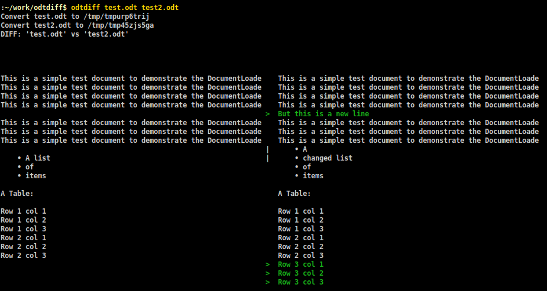
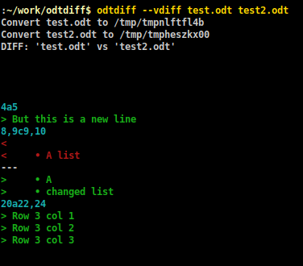
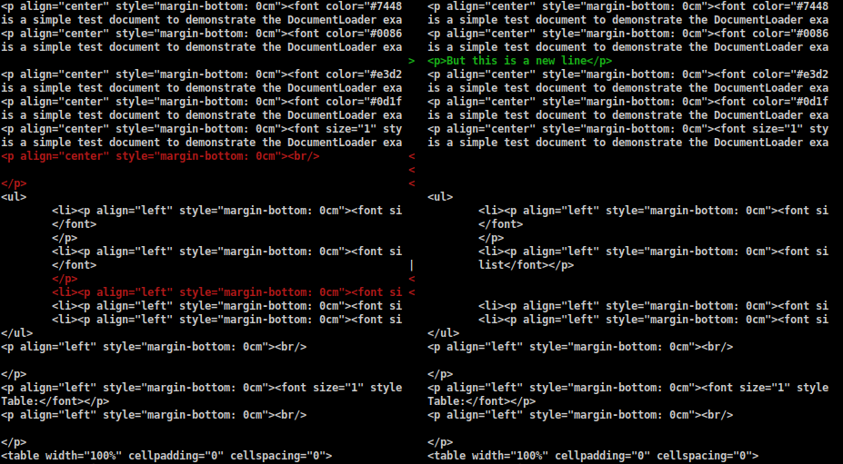
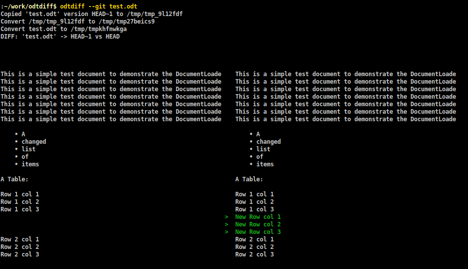
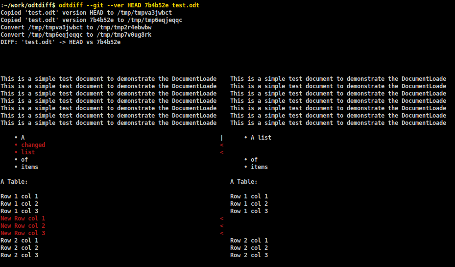
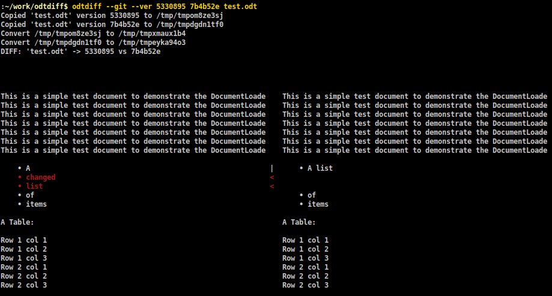
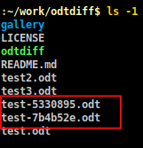

# odtdiff
Python CLI tool to display differences between two Libreoffice Writer ODT files or git versions

## What problem does this solve?

LibreOffice Writer and ODT files are good formats to compose design documents 
or other project documents.

Often, you may need to store them in a versioning system like Git. If two
users have changed an ODT file and committed their respective changes,
git will prevent one of them from pushing their changes because it doesn't
know how to automatically merge changes in ODT files.

Manually merging changes between two ODT files is also cumbersome because 
LibreOfficer Writer's merge dialog is not intuitive. 

These two problems act as barriers to users adopting Libreoffice Writer 
for dcocumentation.

This tool tries to make it easier. For people comfortable with command-line, 
this tool provides a quick way to visualize differences between two ODT files
or git versions or git versions that have to be merged. 

Note that this tool does NOT itself have any merge functionality - that 
still has to be done manually using Writer. However, visualizing
differences on the command-line during a git workflow makes manually merging 
easier.


## Features

+ Compare two ODT (OpenDocument Text) files generated by LibreOffice Writer

+ Compare two versions of the same ODT file in git repo

+ Compare as text or HTML

+ Side-by-side or horizontal diff visualizations


## Examples

### 1. Compare two ODT files and show differences side-by-side

```
odtdiff test.odt test2.odt
```




### 2. Compare two ODT files and show differences vertically

```
odtdiff --vdiff test.odt test2.odt
```




### 3. Compare two ODT files as HTML

```
odtdiff --html test.odt test2.odt
```




### 4. Compare latest two versions of ODT in git

This `git log` for `test.odt` in this repo will be used in following examples:

```

$ git log --oneline test.odt
41613cc (HEAD -> main) test.odt third commit
5330895 test.odt second commit
7b4b52e test.odt first commit

```

```
odtdiff --git test.odt
```




### 5. Compare any two versions of ODT by SHA1 revisions 

```
odtdiff --git --ver HEAD 7b4b52e test.odt
```




### 6. Compare any two versions of ODT by SHA1 revisions 

```
odtdiff --git --ver 5330895 7b4b52e test.odt
```




### 7. Create versions as separate files for easy merging using Writer

Use `--create` option:

```
odtdiff --git --ver 5330895 7b4b52e --create test.odt
```




## How it works

1. It converts ODT files or versions to TXT or HTML files using "libreoffice" executable's
built-in conversion options.

2. It then diff's the two TXT or HTML files.


## Requirements

- LibreOffice Writer should be installed

- Python 3 should be installed (tested against >= 3.5.2; not tested against older versions)

- `diff` (from [GNU diffutils](http://www.gnu.org/software/diffutils/) ) or an equivalent tool whose
  command-line is compatible

- git should be installed if using it for diffing two git versions

- [Colorama python package](https://pypi.org/project/colorama/)


On Ubuntu, all these can be installed with the following commands:

```

sudo apt install libreoffice-writer python3 python3-pip diffutils git-core

sudo python3 -m pip install -U pip

sudo python3 -m pip install colorama

```

## Installation on any Linux distros:

1. `git clone` this repo somewhere - https://github.com/pathbreak/odtdiff.
   
   Or alternatively, download and extract the [repo's zip archive](https://github.com/pathbreak/odtdiff/archive/refs/heads/main.zip).
   
   ```
   cd $HOME
   git clone https://github.com/pathbreak/odtdiff
   cd odtdiff
   chmod +x odtdiff
   ```

2. Create a soft link from `$HOME/.local/bin` to the script:

   ```
   ln -s $HOME/odtdiff/odtdiff  $HOME/.local/bin/odtdiff
   ```
   
3. Add `$HOME/.local/bin` to PATH if it's not already there by adding
   these lines to `~/.bashrc`:


    ```
    if [ -d "$HOME/.local/bin" ] ; then
        PATH="$HOME/.local/bin:$PATH"
    fi
    ```

## Installation on other OSes

1. `git clone` this repo somewhere : https://github.com/pathbreak/odtdiff.
   
   Or alternatively, download and extract the [repo's zip archive](https://github.com/pathbreak/odtdiff/archive/refs/heads/main.zip).
   
2. Ensure that 'odtdiff' is added to PATH.


## Usage

```

usage: odtdiff [-h] [--git] [--ver VERSION VERSION] [--create] [--vdiff]
               [--html]
               ODT-FILE1 [ODT-FILE2]

Compare two LibreOffice Writer files or two git versions of same file.

positional arguments:
  ODT-FILE1             First Writer file
  ODT-FILE2             Second Writer file. Required if comparing two files
                        instead of git versions.

optional arguments:
  -h, --help            show this help message and exit
  --git                 Compare a git-tracked file's current contents with its
                        previous version
  --ver VERSION VERSION
                        Specify the versions to diff.If not specified, current
                        and previous version are used. These are passed to git
                        show. examples: HEAD~2, HEAD~1, HEAD, CURRENT, <commit
                        hash>
  --create              Create the specified versions as separate files
                        suffixed by their versions.
  --vdiff               Use vertical diff instead of side-by-side
  --html                Use HTML diff instead of TXT

```


## License

MIT
